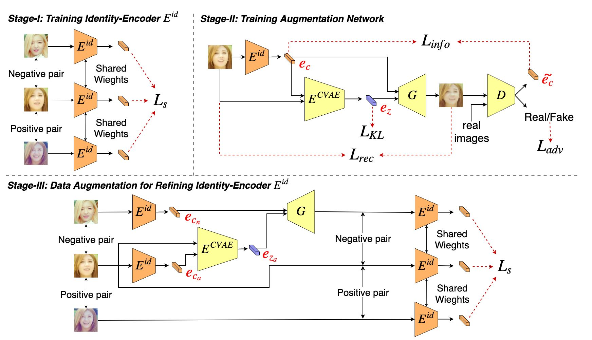

# Learning Face Recognition Unsupervisedly by Disentanglement and Self-Augmentation (ICRA 2020)
Official PyTorch implementaton of ICRA 2020 paper "[Learning Face Recognition Unsupervisedly by Disentanglement and Self-Augmentation](https://ieeexplore.ieee.org/document/9197348)".  
You can visit our project website [here](https://yilunlee.github.io/unsupervised_face_recognition/).

## Introduction
As the growth of smart home, healthcare, and home robot applications, learning a face recognition system which is specific for a particular environment and capable of self-adapting to the temporal changes in appearance (e.g., caused by illumination or camera position) is nowadays an important topic. In this paper, given a video of a group of people, which simulates the surveillance video in a smart home environment, we propose a novel approach which unsuper- visedly learns a face recognition model based on two main components: (1) a triplet network that extracts identity-aware feature from face images for performing face recognition by clustering, and (2) an augmentation network that is conditioned on the identity-aware features and aims at synthesizing more face samples. Particularly, the training data for the triplet network is obtained by using the spatiotemporal characteristic of face samples within a video, while the augmentation network learns to disentangle a face image into identity-aware and identity-irrelevant features thus is able to generate new faces of the same identity but with variance in appearance. With taking the richer training data produced by augmentation network, the triplet network is further fine-tuned and achieves better performance in face recognition. Extensive experiments not only show the efficacy of our model in learning an environment- specific face recognition model unsupervisedly, but also verify its adaptability to various appearance changes.

<div align="center">
  
</div>

## Usage
### Enviroment
#### Prerequisites
#### Other requirements
```

```

### Prepare Dataset


### Evaluation
```
 
```

### Train
1. 
```

```


## Citation
If you find this work useful for your research, please cite:
```Bibtex
@inproceedings{lee2020icra,
 title = {Learning Face Recognition Unsupervisedly by Disentanglement and Self-Augmentation},
 author = {Yi-Lun Lee and Min-Yuan Tseng and Yu-Cheng Luo and Dung-Ru Yu and Wei-Chen Chiu},
 booktitle = {International Conference on Robotics and Automation (ICRA)},
 year = {2020}
}
```

